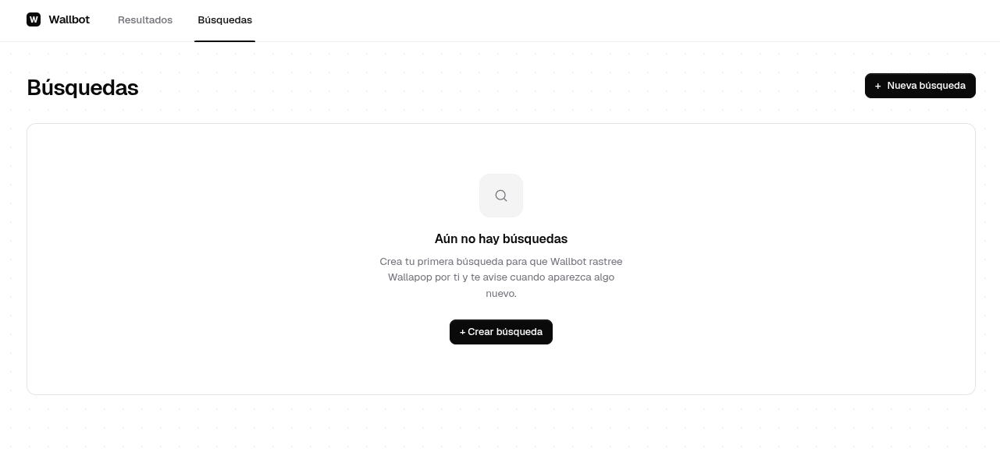
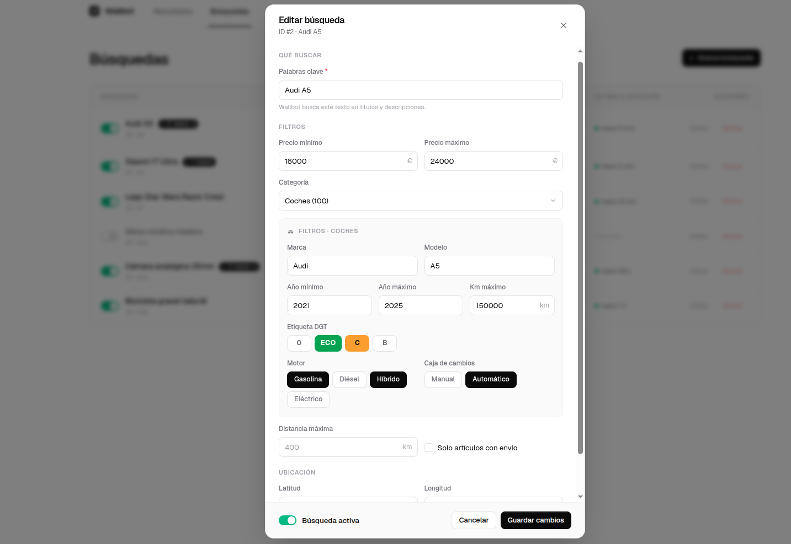
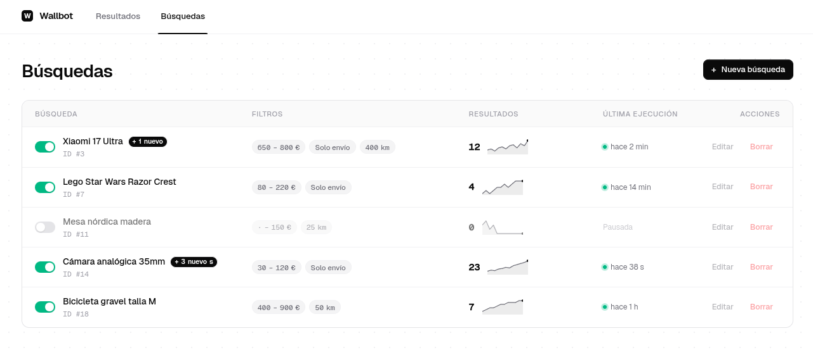
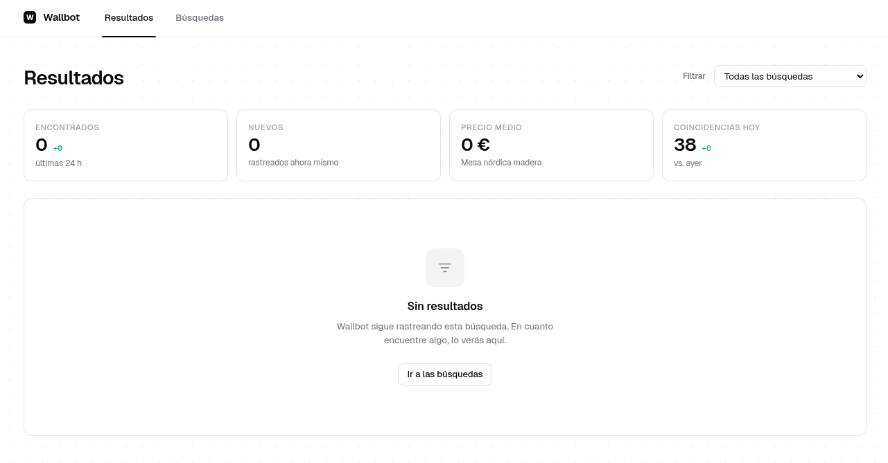
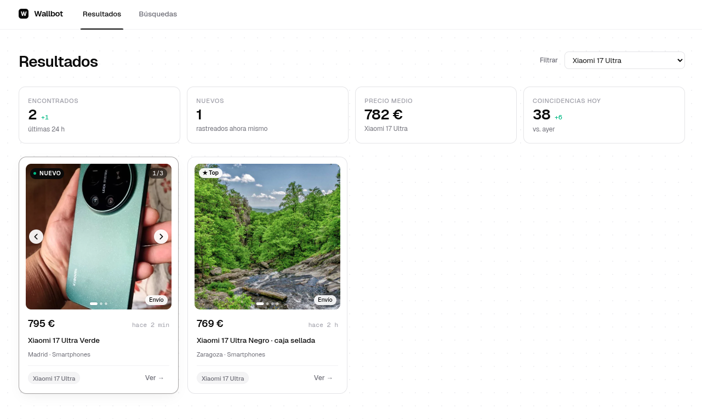

# WallaBot PHP

Bot nativo en PHP 8.5+ para el rastreo de búsquedas en Wallapop y notificaciones automáticas vía Telegram.

## Características
- **Sin dependencias externas**: Código PHP puro sin Composer.
- **Arquitectura robusta**: Basada en el motor de Planify (Calendar), con tipado estricto y Active Record por reflexión.
- **Filtrado Estricto de Títulos**: Filtra el ruido de Wallapop. El bot se asegura de que todas las palabras clave de tu búsqueda existan literalmente en el título del anuncio (ignorando acentos y mayúsculas), evitando falsos positivos por descripciones largas.
- **Notificaciones inteligentes**: Detecta nuevos ítems y bajadas de precio de ítems ya rastreados.
- **Modo Debug y Logs**: Sistema de rotación de logs diario. Posibilidad de activar el modo debug para parsear y guardar JSONs de respuesta de forma legible en `curl.log`.
- **Visualizador web**: Interfaz mínima para revisar los últimos hallazgos.

## Requisitos
- PHP 8.5+
- Extensiones: `pdo_sqlite`, `curl`, `json`, `reflection`.
- SQLite3.

## Cómo crear el bot en Telegram

Para que el script pueda enviarte mensajes, necesitas crear un Bot en Telegram:

1. **Crear el Bot (Token)**:
   - Abre Telegram y busca a **[@BotFather](https://t.me/BotFather)**.
   - Inicia un chat y envía el comando `/newbot`.
   - Sigue las instrucciones para darle un nombre y un nombre de usuario (que debe terminar en `bot`).
   - Al finalizar, BotFather te dará un **Token de acceso** (ej. `123456789:ABCDefGHIJKlmnopQRSTuvwxyz`). Guárdalo, será tu `telegram_bot_token`.

2. **Inicia tu Bot**:
   - Busca el bot que acabas de crear por su nombre de usuario en Telegram y dale a **Iniciar** (o envía `/start`) y envíale un mensaje cualquiera (ej. "Hola"). Si no haces esto, el bot no podrá enviarte mensajes y el script no podrá encontrar tu chat.

## Instalación y Configuración

1. **Preparar la Base de Datos**:
   Ejecuta las migraciones para crear las tablas necesarias en SQLite:
   ```bash
   php src/Commands/Migrate.php
   ```

2. **Configurar Secretos Básicos**:
   Crea el archivo `config/private.local.json` para añadir tu token de Telegram y tu nombre de usuario (sin el `@`):
   ```json
   {
     "telegram_bot_token": "TU_TELEGRAM_BOT_TOKEN",
     "telegram_username": "TU_USUARIO_DE_TELEGRAM",
     "debug": false,
     "auth_user": "admin",
     "auth_password": "tu_password_seguro"
   }
   ```
   *Nota: Los campos `auth_user` y `auth_password` protegen el panel web mediante Autenticación Basic. Si se dejan vacíos en el entorno local, no se solicitará contraseña.*
   *Nota: Si estableces `"debug": true`, todas las peticiones cURL (cabeceras, variables y respuestas JSON prettificadas) se guardarán estructuradas en la carpeta de logs.*

3. **Vincular tu cuenta**:
   Una vez hayas enviado un mensaje al bot desde tu cuenta de Telegram (paso 2 de la sección "Cómo crear el bot"), ejecuta el siguiente comando para que el bot averigüe tu Chat ID y lo guarde permanentemente:
   ```bash
   php src/Commands/SetupTelegram.php
   ```

## Panel de Gestión Web

El bot incluye un panel de gestión profesional (basado en Tailwind CSS) para gestionar las búsquedas y ver los resultados.

1. **Acceso**:
   Levanta el servidor (si no lo tienes ya en un Apache/Nginx):
   ```bash
   php -S localhost:8000 -t public
   ```
2. **Uso**:
   Accede a `http://localhost:8000`. Se te pedirán las credenciales configuradas.
   - **Métricas**: Panel con contadores de hallazgos en las últimas 24h, nuevos rastreos y promedios de precio.
   - **Búsquedas**: Listar, crear, editar y pausar mediante una interfaz de tabla con toggles.
   - **Resultados**: Galería visual de artículos con badges de estado, ubicación y enlaces directos.

### Capturas del panel











## Gestión de Búsquedas

### 1. Añadir una búsqueda
Crea una nueva búsqueda. Si la búsqueda (identificada por `--keywords`) ya existe, se sobrescribirán todos sus campos con los valores pasados (o a null si se omiten).
Usa el comando `AddSearch.php` con los siguientes parámetros:
- `--keywords`: Términos de búsqueda (entre comillas).
- `--min-price`: (Opcional) Precio mínimo.
- `--max-price`: (Opcional) Precio máximo.
- `--cat-ids`: (Opcional) IDs de categorías de Wallapop separadas por comas.
- `--dist`: (Opcional) Distancia máxima en km (por defecto 400).
- `--lat`: (Opcional) Latitud para la búsqueda.
- `--long`: (Opcional) Longitud para la búsqueda.
- `--shippable`: (Opcional) `true` o `false` para filtrar por productos con envío.

**Ejemplo**:
```bash
php src/Commands/AddSearch.php --keywords="Xiaomi 14 Ultra" --lat=42.340 --long=-7.864 --shippable=true
```

### 2. Listar las búsquedas
Muestra por pantalla en forma de tabla todas las búsquedas dadas de alta, tanto activas como inactivas.
```bash
php src/Commands/ListSearch.php
```

### 3. Editar una búsqueda
Permite modificar los valores de una búsqueda existente de forma parcial, sin sobreescribir el resto de parámetros.
Identifica la búsqueda obligatoriamente con `--id` (que puedes ver al listar) y pasa los parámetros que quieras cambiar. Para vaciar un campo previamente configurado, envíale el valor `null`.
- Puedes activar o desactivar la búsqueda enviando `--active=1` o `--active=0`.

**Ejemplo**:
```bash
php src/Commands/EditSearch.php --id=1 --shippable=null --active=0
```

### 4. Borrar una búsqueda
Elimina por completo una búsqueda de la base de datos (y dejará de rastrearse). Identifícala mediante su `--id`.
```bash
php src/Commands/DeleteSearch.php --id=1
```

## Automatización (Cron)

El bot debe ejecutarse periódicamente (recomendado cada minuto) para buscar novedades. Añade la siguiente línea a tu `crontab -e`:

```cron
* * * * * php /ruta/absoluta/a/wallabot-php/src/Commands/Cron.php
```

## Visualización de Resultados

Puedes ver los últimos ítems encontrados abriendo el visualizador web. Para pruebas locales:
```bash
php -S localhost:8000 -t public
```
Y accede a `http://localhost:8000`.

## Estructura de Directorios
- `src/Commands/`: Scripts de consola (Cron, Migraciones, Añadir búsquedas).
- `src/Models/`: Lógica de datos y acceso a SQLite.
- `src/Services/`: Clientes para las APIs de Wallapop y Telegram.
- `src/Utils/`: Utilidades (Database, cURL, Config, Logger).
- `public/`: Punto de entrada para el visualizador web.
- `design/`: Capturas del panel.
- `db/`: Almacenamiento de la base de datos SQLite.
- `logs/`: Registros de ejecución y errores.
